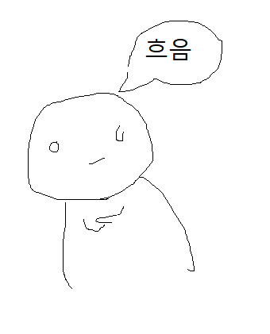

# 이현제

  

**언어별 명칭**  
**한국어**: 이현제, 흐음봇, 봇  
**문화어**: 리현제, 자동흐음기계  
**러시아어**: Рий Хёнжэ, Хммбот  
**영어**: Lee Hyeonje, Hmmbot  
**일본어**: リ・ヒョンジェ, フム・ボット, ボット  

[TOC]

## 소개  

~~**흐음 으에에**~~  
**서울대학교 자유전공학부 제6대 학생회장**  
~~이 현제는 무료로 해줍니다! 이제 무료 아님~~

1992년 8월 27일 출생. 2011년 한**영**외국어고등학교를 졸업하고, 2012년 서울대학교 자유전공학부에 입학했다. 자유전공학부 학생회의 여러 요직을 거친 뒤 2013년 말 자유전공학부 제6대 학생회장으로 당선되어 2014년 말까지 임기를 수행했다. 현재는 모 업체에서 산업기능요원으로 근무 중이다.

## 행적

### 행적/한영외고 및 이전  

서울대학교 입학 이전 그의 행적은 잘 알려져있지 않다. 공개적으로 알려진 정보라고는 재수를 했는데 재수학원을 다니다가 때려치우고 독학재수를 해서 성공했다는 것 정도...? **심지어 학창시절 그가 "흐음"이나 "으에에"를 했는지조차 알려져있지 않다!** "흐음 으에에"를 하지 않는 이현제를 흐음봇이라 부를 수 있을까?  

### 행적/서울대학교 입학 초기
### 행적/서울대학교 자유전공학부 학생회장
### 행적/산업기능요원 복무 이전
### 행적/산업기능요원 복무 이후

## 평가

### 평가/긍정적

**자전을 다시 위대하게 이끌었던 인물**  
  
학생회장 시절 그의 가장 큰 업적은 **학생회 재정 확보.** 학생회비를 납부하지 않으면 학생회 주최 어떠한 행사도 참여할 수 없다는 초강경책을 밀어붙여 학생회비 납부율을 성공적으로 끌어올렸으며, 이를 통해 자전 학생회는 비교적 풍족한 재정을 바탕으로 김재휘 비대위 체제까지 학생 복지를 위한 다양한 사업을 진행할 수 있게 된다. 이후 제8대 학생회에서 새내기배움터 지원금 명목으로 수백만 원의 학생회비를 포퓰리즘으로 뿌리면서 자전 학생회는 다시 재정난에 시달리게 된다.

또한 현재는 없어진 **자유전공학부 통합커뮤니티 구축 및 유지보수**에도 큰 역할을 했다. 하지만 이 또한 제8대 학생회 들어서 심화된 재정난으로 해체를 결의하게 된다. ~~이것만 보면 제7대 학생회의 모토는 "Anything But Leehyeonje" 같다~~

### 평가/부정적

**흐음봇이 흐음봇이라 불리는 이유**  
  
**흐음, 으에에, 놀아주세요** 등등 필요없는 추임새를 너무 많이 넣어서 주변 사람들을 짜증나게 한다.

## 여담

**등산 요금표**  
흐음 3미터  
으에에 5미터  
놀아주세요 10미터
